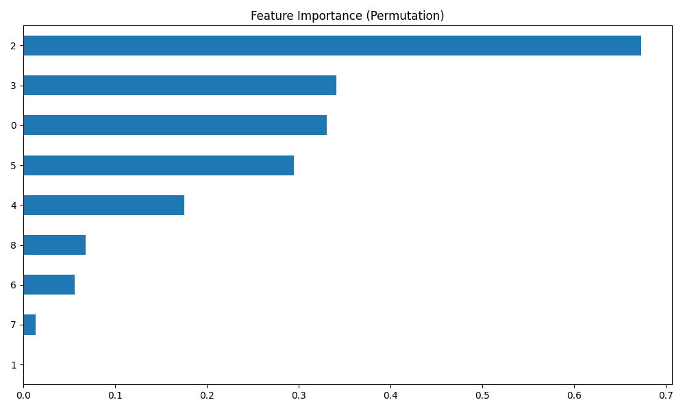
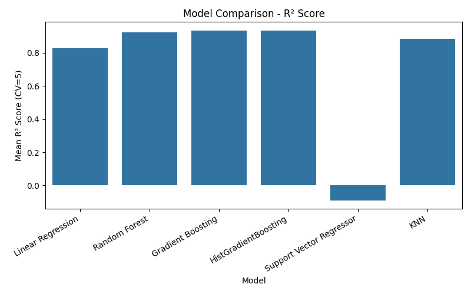

# 💰 Earn-It: AI-Powered Salary Prediction System

Predict salaries based on professional experience, education, job role,
and other career-related attributes using Machine Learning.

Earn-It is an end-to-end Data Science project that demonstrates the
complete machine learning lifecycle, from data preprocessing and
exploratory data analysis to model training, evaluation, and deployment
through a Flask web application.

------------------------------------------------------------------------

## 🚀 Features

-   🔮 Salary prediction using Machine Learning
-   📊 Interactive data visualizations
-   📈 Exploratory Data Analysis (EDA)
-   🤖 Multiple ML model comparison
-   📉 Model evaluation metrics
-   🌐 Flask web application
-   📱 Responsive UI
-   🌙 Dark/Light mode
-   ⚡ Fast predictions

------------------------------------------------------------------------

## 🛠 Tech Stack

### Backend

-   Python
-   Flask
-   Scikit-learn
-   Pandas
-   NumPy

### Frontend

-   HTML5
-   CSS3
-   JavaScript

### Visualization

-   Matplotlib
-   Seaborn
-   Chart.js

### Machine Learning

-   Regression Algorithms
-   Feature Engineering
-   Model Evaluation
-   Hyperparameter Tuning

------------------------------------------------------------------------

## 📂 Project Structure

``` text
Earn-It/
│
├── data/
│   └── Salary Data.csv
├── models/
│   └── salary_predictor.pkl
├── src/
│   ├── train.py
│   ├── app.py
│   └── utils.py
├── templates/
│   └── index.html
├── static/
│   ├── css/
│   ├── js/
│   └── images/
├── requirements.txt
├── app.py
└── README.md
```

------------------------------------------------------------------------

## 📊 Dataset

The project uses a salary dataset containing features such as:

-   Age
-   Gender
-   Education Level
-   Job Title
-   Years of Experience
-   Skills
-   Company Tier
-   Certifications
-   Salary

------------------------------------------------------------------------

## ⚙️ Installation

``` bash
git clone https://github.com/girishsakpal/Earn-It.git
cd Earn-It

python -m venv venv

# Windows
venv\Scripts\activate

# Linux / macOS
source venv/bin/activate

pip install -r requirements.txt
python src/app.py
```

Visit: `http://127.0.0.1:5000`

------------------------------------------------------------------------

## 🧠 Machine Learning Workflow

``` text
Dataset
    │
    ▼
Data Cleaning
    │
    ▼
Feature Engineering
    │
    ▼
Train/Test Split
    │
    ▼
Model Training
    │
    ▼
Evaluation
    │
    ▼
Save Model
    │
    ▼
Flask Web App
```

------------------------------------------------------------------------

## 📈 Model Evaluation

The trained model is evaluated using:

-   Mean Absolute Error (MAE)
-   Mean Squared Error (MSE)
-   Root Mean Squared Error (RMSE)
-   R² Score

The best-performing model is serialized using Joblib and served through
Flask for real-time predictions.

------------------------------------------------------------------------

## Models⚙️

<p>
    <h2>Feature Importance</h2>
    
</p>

<p>
    <h2>Model Comparison</h2>
    
</p>


------------------------------------------------------------------------

## 💡 Future Improvements

-   User Authentication
-   Salary Trends Dashboard
-   Resume-based Salary Prediction
-   Skill Recommendation System
-   Career Growth Suggestions
-   Live Salary Data Integration
-   Docker Deployment
-   Cloud Deployment

------------------------------------------------------------------------

## 🤝 Contributing

Contributions are welcome! Fork the repository, create a feature branch,
commit your changes, push them, and open a Pull Request.

------------------------------------------------------------------------

## 📜 License

This project is licensed under the MIT License.

------------------------------------------------------------------------

## 👨‍💻 Author

**Girish Sakpal**

-   GitHub: https://github.com/girishsakpal
-   LinkedIn: https://www.linkedin.com/in/girish-sakpal-a58840342/

------------------------------------------------------------------------

⭐ If you found this project helpful, consider giving it a star!
