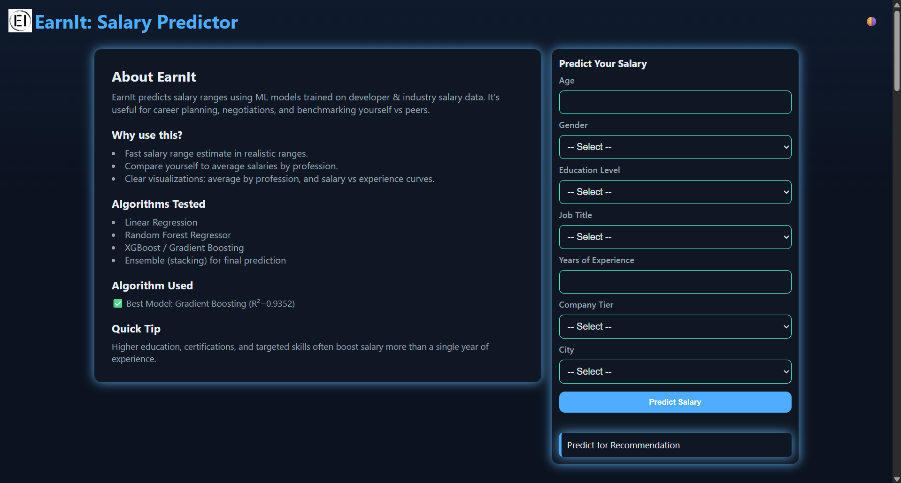
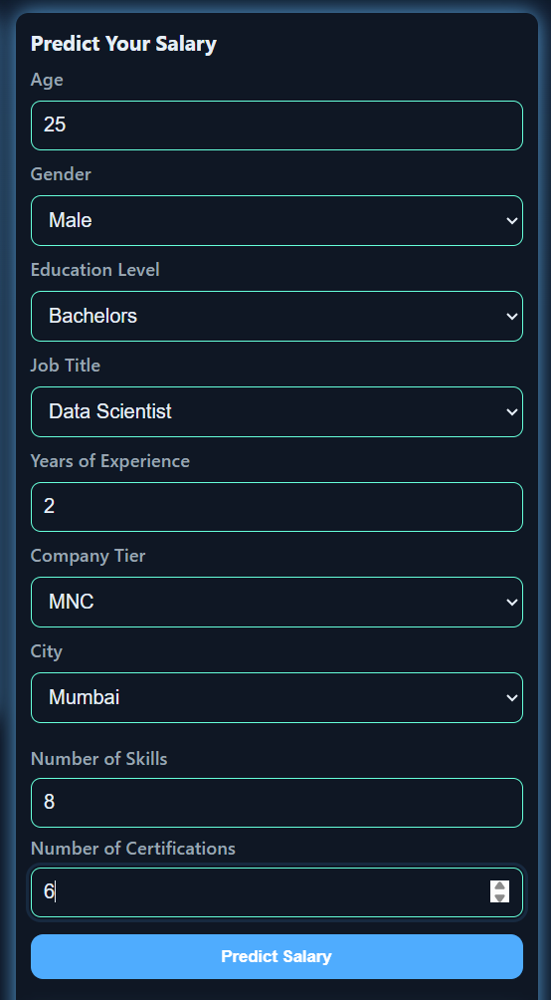
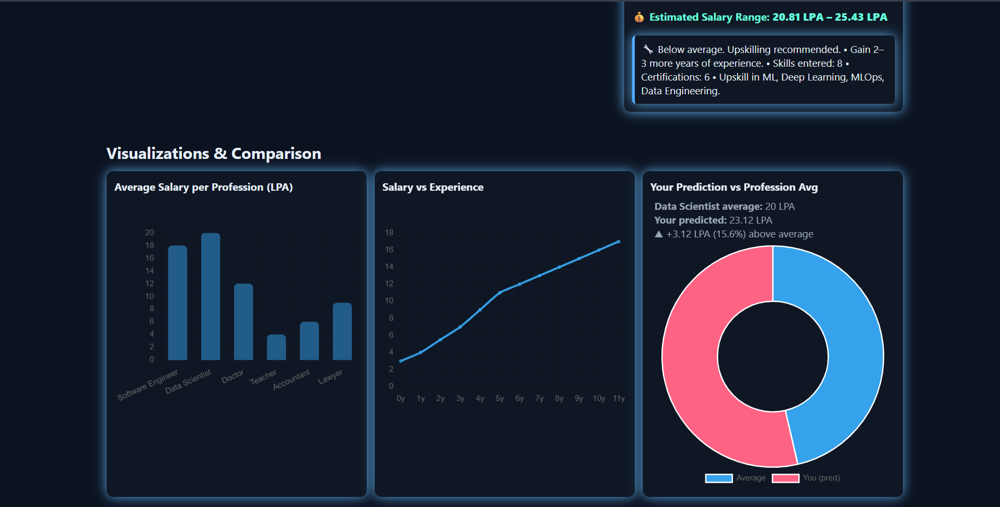
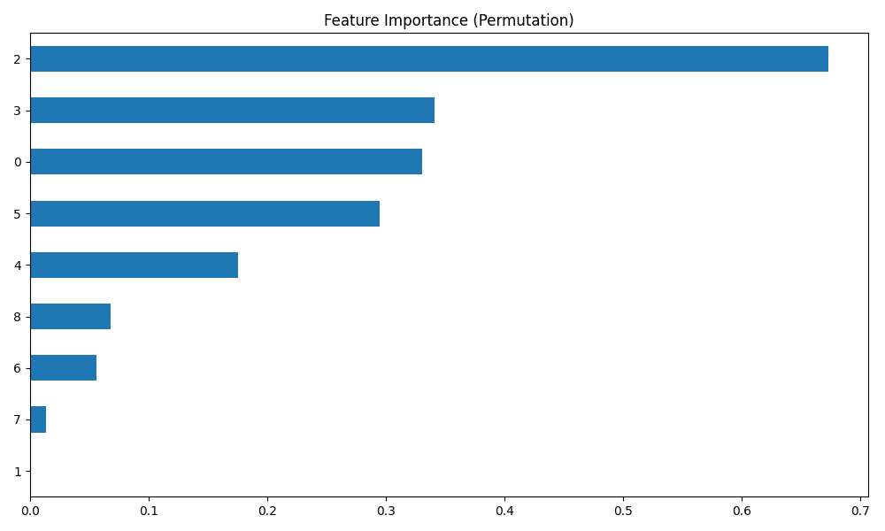
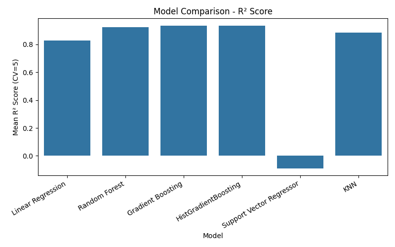
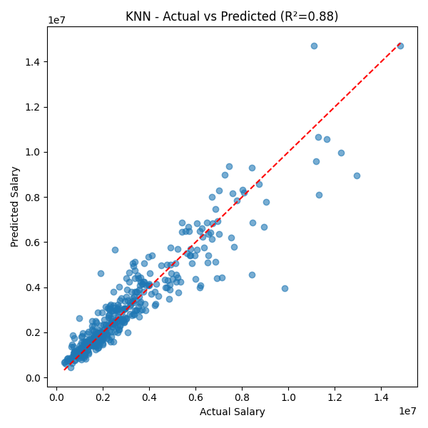
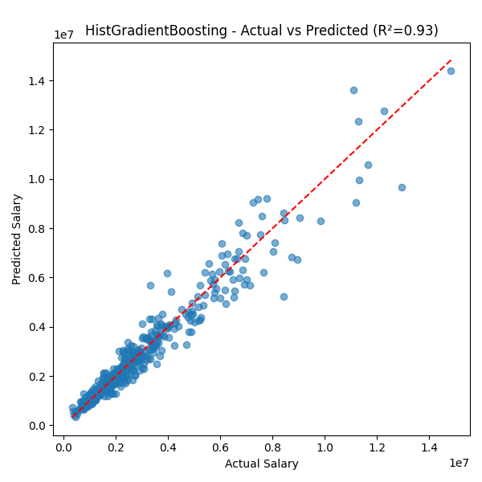

# 💰 Earn-It: AI-Powered Salary Prediction System

> An end-to-end Machine Learning application that predicts salaries based on professional and career-related attributes.

**Earn-It** is an AI-powered salary prediction system built using Machine Learning and Flask. The project demonstrates the complete Data Science workflow-from data preprocessing and feature engineering to training multiple regression models, evaluating their performance, and deploying the best-performing model through an interactive web application.

---

## 🚀 Features

* 🔮 Predict salary based on professional attributes
* 📊 Interactive dashboard and data visualizations
* 🤖 Comparison of multiple Machine Learning models
* 📈 Model performance analysis and evaluation
* 💰 Real-time salary prediction
* 🧠 Feature importance analysis
* 📉 Predicted vs actual value visualization
* 🌙 Dark/Light mode support
* 📱 Responsive user interface
* 🌐 Flask-based web application

---

# 🖥️ Application Preview

## 🏠 Home Page

The landing page introduces the **Earn-It Salary Prediction System** and provides users with access to the application's prediction and analytics features.

<p align="center">
  
</p>

---

## 🔮 Salary Prediction

Users can enter their professional details, such as education, job role, experience, skills, certifications, and company-related information to generate a salary prediction.

<p align="center">
  
</p>

---

## 💰 Prediction Result

After submitting the details, the Machine Learning model processes the input and provides an estimated salary prediction.

<p align="center">
  
</p>

---

# 📊 Machine Learning Visualizations

## Feature Importance

This visualization shows which input features have the greatest influence on the salary prediction.

<p align="center">
  
</p>

---

## Model Comparison

Multiple regression algorithms were trained and compared to identify the best-performing model.

<p align="center">
  
</p>

---

## Predicted vs Actual Values

The following visualizations compare the predicted salary values generated by different Machine Learning models with the actual values.

### Gradient Boosting

<p align="center">
  
</p>

### Random Forest

<p align="center">
  
</p>

### KNN Regressor

<p align="center">
  
</p>

### Support Vector Regressor

<p align="center">
  
</p>

### Linear Regression

<p align="center">
  
</p>

### Histogram Gradient Boosting

<p align="center">
  
</p>

---

# 🧠 Machine Learning Workflow

```text
Dataset
   │
   ▼
Data Cleaning & Preprocessing
   │
   ▼
Feature Engineering
   │
   ▼
Train-Test Split
   │
   ▼
Multiple Model Training
   │
   ▼
Model Evaluation & Comparison
   │
   ▼
Best Model Selection
   │
   ▼
Model Serialization
   │
   ▼
Flask Web Application
   │
   ▼
Real-Time Salary Prediction
```

---

# 🤖 Machine Learning Models

The project experiments with multiple regression algorithms, including:

* Linear Regression
* K-Nearest Neighbors Regressor
* Random Forest Regressor
* Gradient Boosting Regressor
* Support Vector Regressor
* Histogram Gradient Boosting Regressor

The models are evaluated using multiple regression metrics, and the best-performing model is selected for deployment.

---

# 📏 Model Evaluation

The Machine Learning models are evaluated using:

| Metric       | Description                                                  |
| ------------ | ------------------------------------------------------------ |
| **MAE**      | Measures the average prediction error                        |
| **MSE**      | Measures the average squared prediction error                |
| **RMSE**     | Represents the standard deviation of prediction errors       |
| **R² Score** | Indicates how well the model explains the variance in salary |

---

# 📂 Project Structure

```text
Earn-It/
│
├── data/
│   └── Salary Data.csv
│
├── models/
│   └── salary_predictor.pkl
│
├── static/
│   ├── screenshots/
│   │   ├── home.png
│   │   ├── dashboard.png
│   │   ├── prediction-form.png
│   │   ├── prediction-result.png
│   │   └── analytics.png
│   │
│   ├── Figure_1_Feature_Importance.png
│   ├── model_comparison.png
│   ├── *_pred_vs_actual.png
│   ├── *_residuals.png
│   ├── style.css
│   └── script.js
│
├── template/
│   └── index.html
│
├── app.py
├── requirements.txt
└── README.md
```

---

# 📊 Dataset

The salary prediction model uses career-related features such as:

* Age
* Gender
* Education Level
* Job Title
* Years of Experience
* Skills
* Company Tier
* Certifications
* Salary

These features are processed and transformed before being used for Machine Learning model training.

---

# 🛠️ Tech Stack

### Backend

* Python
* Flask

### Machine Learning

* Scikit-learn
* Regression Algorithms
* Feature Engineering
* Model Evaluation

### Data Processing

* Pandas
* NumPy

### Frontend

* HTML5
* CSS3
* JavaScript

### Visualization

* Matplotlib
* Seaborn
* Chart.js

---

# ⚙️ Installation & Setup

### 1. Clone the repository

```bash
git clone https://github.com/girishsakpal/Earn-It.git
cd Earn-It
```

### 2. Create a virtual environment

```bash
python -m venv venv
```

### 3. Activate the environment

**Windows**

```bash
venv\Scripts\activate
```

**Linux/macOS**

```bash
source venv/bin/activate
```

### 4. Install dependencies

```bash
pip install -r requirements.txt
```

### 5. Run the application

```bash
python app.py
```

Open your browser and visit:

```text
http://127.0.0.1:5000
```

---

# 💡 Future Improvements

* 🔐 User authentication and personalized profiles
* 📊 Advanced salary trends dashboard
* 📄 Resume-based salary prediction
* 🧠 Skill recommendation system
* 🚀 Career growth suggestions
* 🌐 Live salary market data integration
* 🐳 Docker containerization
* ☁️ Cloud deployment

---

# 🤝 Contributing

Contributions are welcome!

1. Fork this repository.
2. Create a new feature branch.
3. Make your changes.
4. Commit your changes.
5. Push the branch.
6. Open a Pull Request.

---

# 📜 License

This project is created for educational and learning purposes.

---

<p align="center">
  Made with ❤️ using Python, Machine Learning and Flask
</p>
